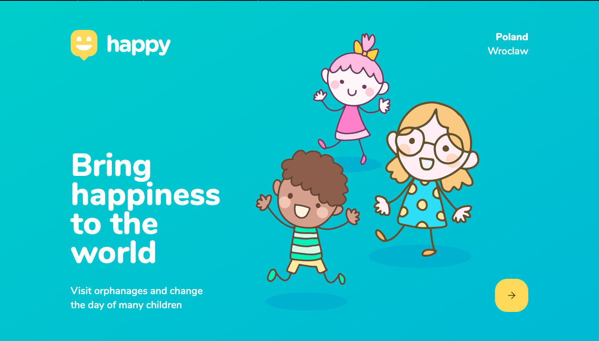
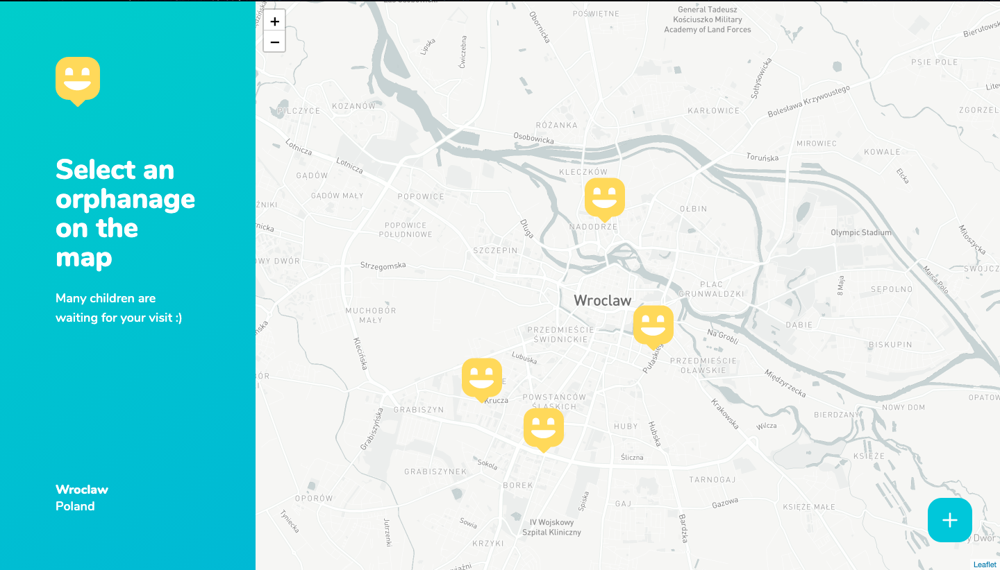
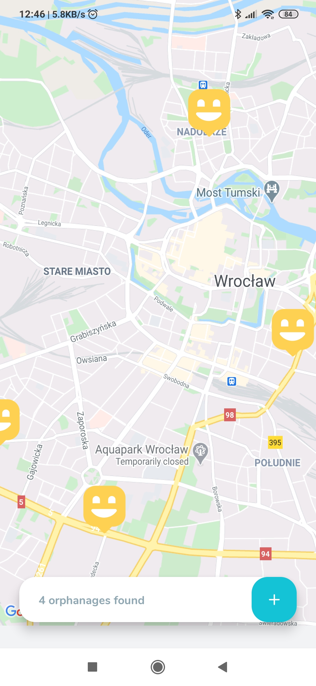
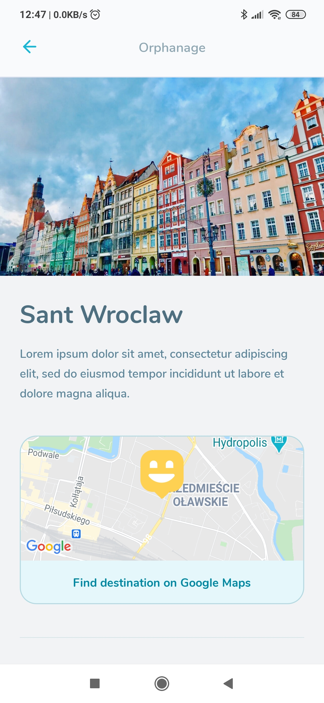

<p align="center">
   
</p>

<p align="center">	
  <a href="https://www.linkedin.com/in/marco-echevestre/">
      
  </a>
  
  
  <a href="https://github.com/marcoaminotto/proffy/commits/master">
    
  </a> 
  
  
</p>

> :book: Happy is an online platform which assists people to visit children in orphanages and make their days more happy. This project was based on the [NLW #3](https://nextlevelweek.com) event.

# 📐 Layout

## Web

<div align="center">
  
  
</div>

## Mobile

<div align="center">
   
   
</div>

# :rocket: Technologies
This project was made using the following technologies:

* [Typescript](https://www.typescriptlang.org/)
* [Node.js](https://nodejs.org/en/about/) / [Express](https://expressjs.com/)
* [React](https://reactjs.org/)
* [React Native](https://reactnative.dev/) / [Expo](https://expo.io/)

# 🔧 How to run
```bash
# Clone Repository
$ git clone git@github.com:marcoaminotto/happy.git
```

### 📦 Run server

```bash
# Go to server folder
$ cd happy/server

# Install dependencies
$ yarn install

# Execute migrations
$ yarn typeorm migration:run

# Run the aplication
$ yarn dev
```
To check if it is working, click on http://localhost:3333/orphanages. If it returns a JSON ```[]``` then the server is working 🎉. 

### 💻 Run web application

```bash
# Go to web folder
$ cd happy/web

# Install Dependencies
$ yarn install

# Run Aplication
$ yarn start
```
Go to http://localhost:3000/ to see the awesome website.

### 📱 Run mobile application
To run the mobile project you need a smartphone with the app of [expo](https://play.google.com/store/apps/details?id=host.exp.exponent) installed or a android/ios emulator on your computer.

```bash
# Go to mobile folder
$ cd happy/mobile

# Install Dependencies
$ yarn install

# Run Aplication
$ yarn start
```
Read the QRCode with the app of [expo](https://play.google.com/store/apps/details?id=host.exp.exponent) or run on your emulator.

# :closed_book: License

Released in 2020 :closed_book: License

This project is under the [MIT license](./LICENSE).


Give a ⭐️ if this project helped you!

#
<p align="center">
   <b> &#60;/&#62; by <a href="https://www.linkedin.com/in/marco-echevestre/">Marco Echevestre</a></b>
</p>
